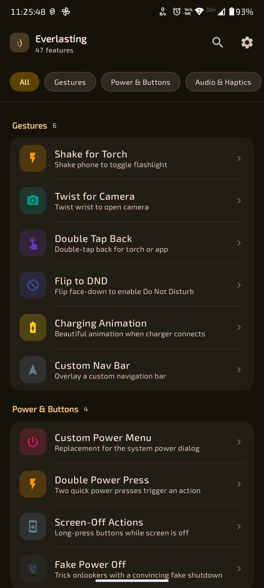
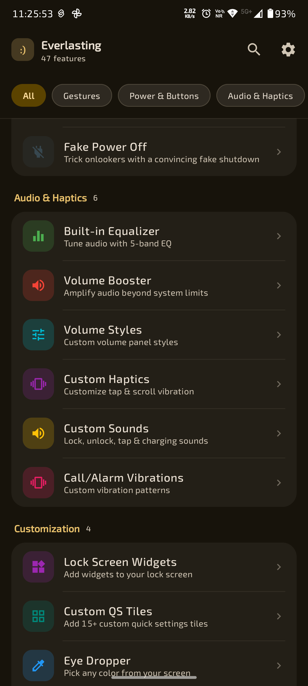
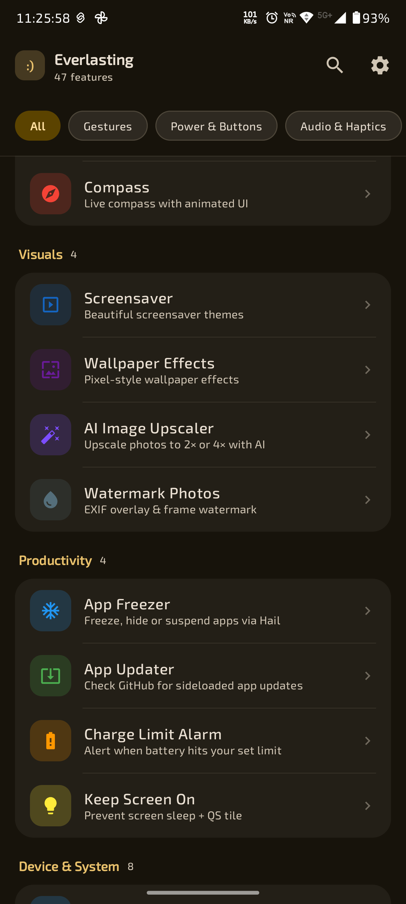
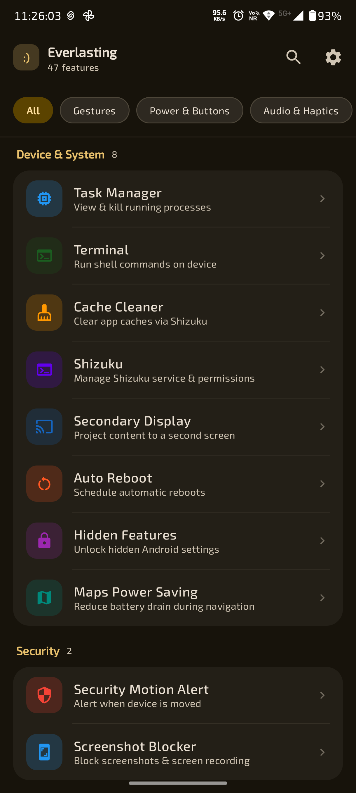
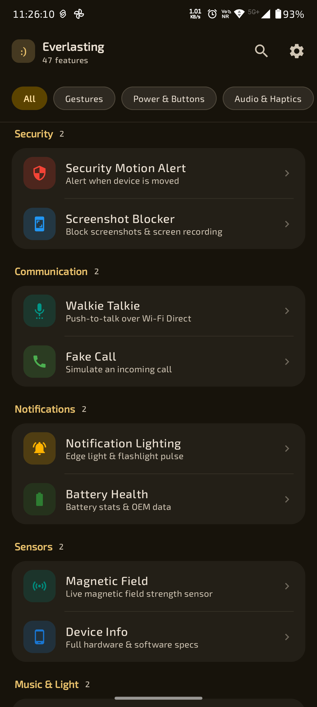
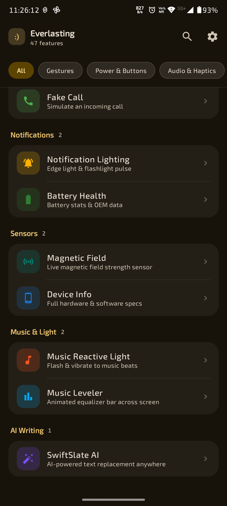
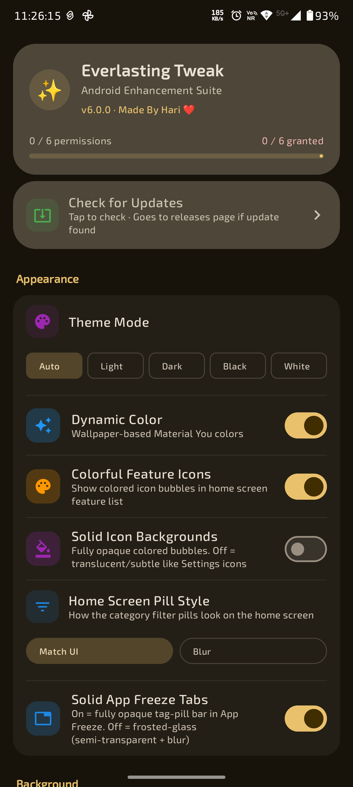
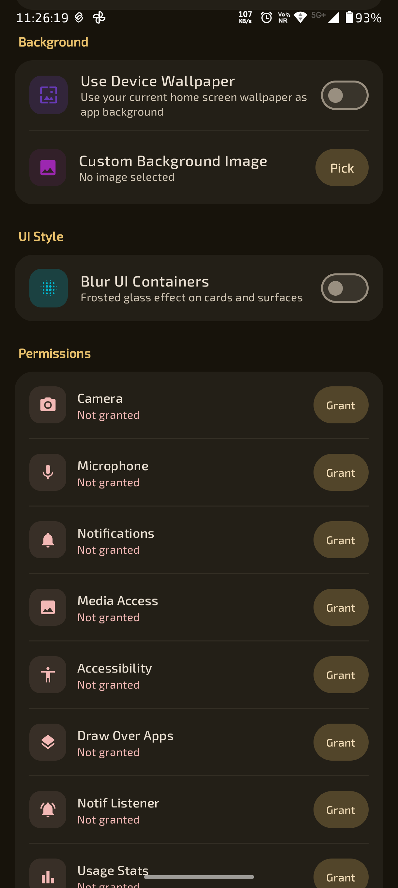
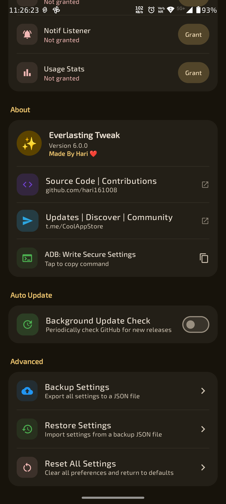
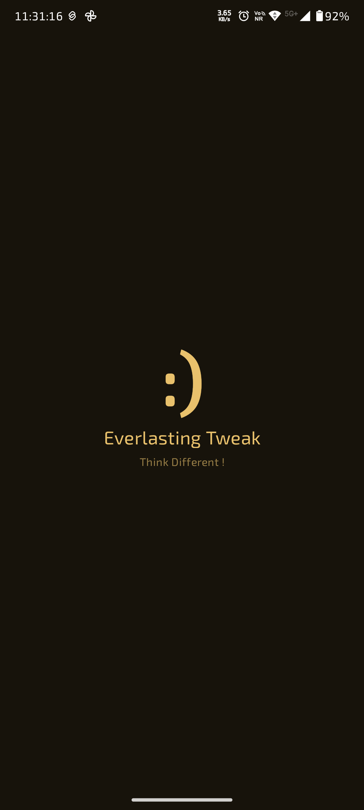

# Everlasting Android Tweak

 

  

 

Everlasting Android Tweak is the true heart of Android, powerful, feature rich toolkit designed to unlock the full potential of your Android device. It provides you many advanced gestures, customization, system controls, and smart utilities to enhance and personalize your device experience. 
 

# 📦 Latest Releases: 
GitHub: [Download](https://github.com/hari161008/Everlasting-Android-Tweak/releases) ⬇️

# Telegram Links:

🚀 App Recommending Channel:
<a href="https://t.me/CoolAppStore">Join Now</a>
📢 App Support Group:
<a href="https://t.me/EverlastingAndroidTweak">Join Now</a>

 

# Screenshots:

 

  
  
  

  
  
  

  
  
  

  
  
  

 
 

# Features of Everlasting Android Tweak .✦ ݁˖
┈➤ Gestures

• 🔦 Shake for Torch – Shake your phone to toggle the flashlight  
• 📸 Twist for Camera – Twist your wrist to quickly open the camera  
• 👆 Double Tap Back – Double-tap the back for torch or custom app  
• 🔕 Flip to DND – Flip device face-down to enable Do Not Disturb  
• ⚡ Charging Animation – Beautiful animation when charger connects  
• 📱 Custom Nav Bar – Overlay your own custom navigation bar  
 
 
┈➤ Power & Buttons

• 🔌 Custom Power Menu – Replace the default system power dialog  
• ⚡ Double Power Press – Trigger actions with two quick presses  
• 🔘 Screen-Off Actions – Long-press buttons even when screen is off  
• 🎭 Fake Power Off – Simulate a realistic fake shutdown  
 
 
┈➤ Audio & Haptics

• 🎚️ Built-in Equalizer – Fine-tune audio with a 5-band EQ  
• 🔊 Volume Booster – Increase volume beyond system limits  
• 🎛️ Volume Styles – Customize the volume panel UI  
• 📳 Custom Haptics – Adjust tap & scroll vibration feedback  
• 🔔 Custom Sounds – Set sounds for lock, unlock, tap & charging  
• ⏰ Call/Alarm Vibrations – Custom vibration patterns  
 
 
┈➤ Customization

• 🧩 Lock Screen Widgets – Add widgets directly to your lock screen  
• ⚙️ Custom QS Tiles – Add 15+ quick settings tiles  
• 🎨 Eye Dropper – Pick any color from your screen  
• 🧭 Compass – Live compass with animated UI  
 
 
┈➤ Visuals

• 🌌 Screensaver – Beautiful themed screensavers  
• 🖼️ Wallpaper Effects – Pixel-style wallpaper enhancements  
• 🤖 AI Image Upscaler – Upscale images to 2× or 4×  
• 📷 Watermark Photos – Add EXIF overlay & custom frames  
 
 
┈➤ Productivity

• ❄️ App Freezer – Freeze, hide, or suspend apps (via Hail)  
• 🔄 App Updater – Check GitHub for sideloaded app updates  
• 🔋 Charge Limit Alarm – Get notified at a set battery level  
• ⏳ Keep Screen On – Prevent screen sleep + quick tile  
 
 
┈➤ Device & System (Not working right now)

• 📊 Task Manager – View & kill running processes  
• 💻 Terminal – Run shell commands on your device  
• 🧹 Cache Cleaner – Clear app cache (via Shizuku)  
• 🔐 Shizuku Manager – Control Shizuku service & permissions  
• 🖥️ Secondary Display – Cast content to another screen  
• 🔁 Auto Reboot – Schedule automatic restarts  
• 🧩 Hidden Features – Unlock hidden Android settings  
• 🗺️ Maps Power Saving – Reduce battery usage during navigation  
 
 
┈➤ Security

• 🚨 Motion Alert – Get notified when your device is moved  
• 🔒 Screenshot Blocker – Prevent screenshots & screen recording  
 
 
┈➤ Communication

• 📡 Walkie Talkie – Push-to-talk via Wi-Fi Direct  
• 📞 Fake Call – Simulate incoming calls  
 
 
┈➤ Notifications & Sensors

• 💡 Notification Lighting – Edge lighting & flashlight alerts  
• 🔋 Battery Health – View battery stats & OEM data  
• 🧲 Magnetic Field Sensor – Real-time magnetic field strength  
• 📱 Device Info – Full hardware & software details  
 
 
┈➤ Music & Light

• 🎵 Music Reactive Light – Flash & vibrate to music beats  
• 📊 Music Leveler – Animated equalizer across the screen  
 
 
┈➤ AI Writing

• ✍️ SwiftSlate AI – AI-powered text replacement anywhere  
